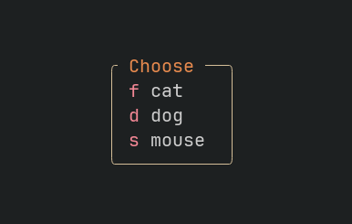

<p align="center">

<p align="center">Simple and quick picker. <b>Single Stroke</b> UI selector for Neovim.</p>




## ⚡️ Features

- Take user input fast with a single keystroke
- Lightweight and easy to integrate
- Perfect for plugin developers and custom Neovim configurations
- Minimal UI that doesn't disrupt your focus

## 📋 Installation

Using Lazy:
```
return {
	"divagueame/lacasitos.nvim",
	config = function()
		require("lacasitos").setup()
	end,
}
```

## ☄ Usage
```
local lacasitos = require("lacasitos")
local animals = { "cat", "dog", "mouse"}
selected_option = lacasitos.choose_option(animals)
```

## Examples

In your plugin or Neovim config:
```
-- Example: Quick theme switcher
local themes = { "gruvbox", "nord", "tokyonight" }
local selected_theme = lacasitos.choose_option(themes)
vim.cmd("colorscheme " .. selected_theme)
```

## ⌨ Contributing

PRs and issues are always welcome. Make sure to provide as much context as possible when opening one.

## 📜 License
Distributed under the MIT License. See LICENSE for more information.

